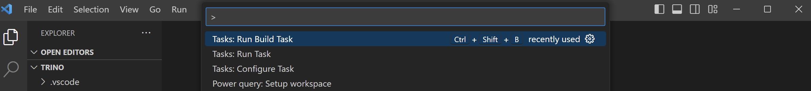
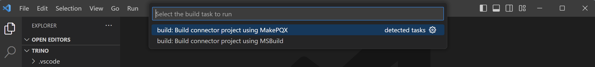
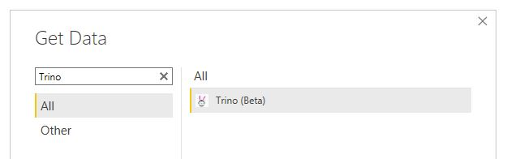
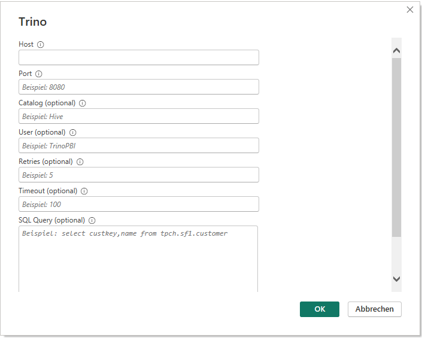
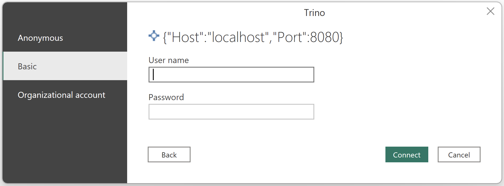
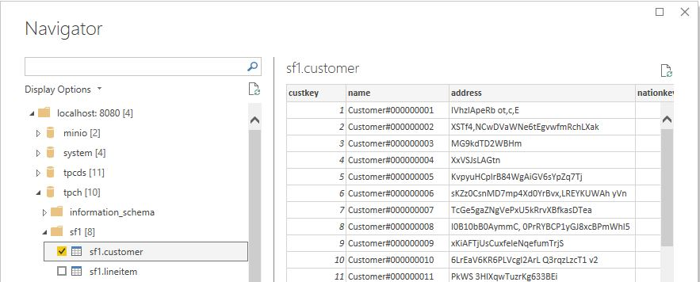

# Power BI Trino
A Microsoft Power BI Custom Connector for importing Trino data into Power BI to interactively transform, visualize and analyze data. 

## Trino client REST API
The connector communicates directly with the [Trino client REST API](https://trino.io/docs/current/develop/client-protocol.html) to retrieve data and provides some pararmeters to configure. Client timeout errors (ABANDONED_QUERY) can be fixed by changing the value of query.client.timeout in the coordinators config.properties file (the default is 5 minutes).

## Authentication
 The supported [authentication kinds](https://learn.microsoft.com/en-us/power-query/handling-authentication#authentication-kinds) are Anonymous, Basic (UsernamePassword) and OAuth.

## Need further support?
In case you encounter any issues while installing or loading data, just open an issue or feel free to reach out to one of the contributors of this repository. 

## Usage: Power BI Desktop 
If you want to customize the connector or to use OAuth, you will need to build a .mez file yourself by following this step-by-step guide. Otherwise, for just using the connector, you can go right to step 6.

1. Install [Visual Studio Code](https://code.visualstudio.com/) and the [Power Query SDK
extension](https://marketplace.visualstudio.com/items?itemName=PowerQuery.vscode-powerquery-sdk).

2. Clone this repository and open the folder `Trino` in Visual Studio Code. (If you open the main folder of this repository, then the Power Query SDK extension won't recognise it as an extension project.)

3. (Optional) Modify the file `Trino.pq` as needed, for OAuth in particular the function `TokenMethod`. The current `Trino.pq` has been written for OAuth using [AWS Cognito](https://docs.aws.amazon.com/cognito/latest/developerguide/what-is-amazon-cognito.html), but your particular use case may well require a different protocol. See the [official documentation](https://learn.microsoft.com/en-us/power-query/install-sdk) for more information. [This post](https://jussiroine.com/2019/02/building-a-custom-connector-for-power-bi-that-supports-oauth2-to-visualize-my-wellness-data/) is also helpful. Note that changes made to `Trino.pq` may affect which files need to be created in the next step.

4. (Optional) For OAuth various files need to be created to store the configuration of your setup. The all begin with the prefix `oauth_config_`, which is included in `.gitignore` to guard against unintenionally committing credentials.

    * `oauth_config_client_id.txt`  
    This should contain your application's Client ID. Don't commit this.

    * `oauth_config_client_secret.txt`  
    This should contain your application's Client Secret. _Really_ don't commit this.

    * `oauth_config_authorize_uri.txt`  
    This should contain the URI of your authorize-endpoint. An example:
      ```
      https://<your-app>.auth.<aws-region>.amazoncognito.com/oauth2/authorize
      ```

    * `oauth_config_scopes.txt`  
    This should contain the OAuth scopes. An example:
      ```
      openid
      ```
      Remark: It should be possible to include more than one scope (space- or comma-seprated?), but this has not been tested.
    
    * `oauth_config_token_uri.txt.txt`  
    This should contain the URI of your token-endpoint. An example:
      ```
      https://<your-app>.auth.<aws-region>.amazoncognito.com/oauth2/token
      ```

    This information is included in `.gitignore` to not commit it into this public repo.

5. The .mez file now needs to be built. In the Command Palette, select "Tasks: Run Build Task" (type "> b" to find it):

    

    Then select the option to use MakePQX:

    

    If all goes well, the file `Trino.mez` should appear in the folder `Trino\\bin\\AnyCPU\\Debug`. 

6. Take the pre-built .mez from this [link](Trino/bin/AnyCPU/Debug/Trino.mez) or if customized from your debug folder and place it in your local `Documents\Power BI Desktop\Custom Connectors` folder, as outlined in the [documentation](https://learn.microsoft.com/en-us/power-query/install-sdk#build-and-deploy). Once done, you should be able to see the connector listed in your "Get Data" window, restart Power BI Desktop in case it doesn't appear:

    

7. Populate the required and optional fields to communicate with your Trino environment and hit OK to either scan your objects or to execute a specific SQL query if provided:

    

8. Choose the desired authentication mechanism:

    

9. Choose the desired objects you want to import and click "Load" if you want to import data directly. Clicking "Transform Data" allows you to transform data before actually importing it into the analytical storage engine:

    

## Usage: Power BI Service
To support end-to-end refresh through the Power BI Service on the cloud, it requires you to setup an [on-premise data gateway](https://docs.microsoft.com/en-us/power-bi/connect-data/service-gateway-custom-connectors). Once the connector is officially supported, this is not required anymore.

## Releases

**April 2024**
- 2024-04-04: Optimizing data type conversion for date and time

**February 2024**
- 2024-02-07: Native SQL Query parameter added

**April 2023**
- 2023-04-26: OAuth added

**October 2021**
- 2021-10-15: First Release
